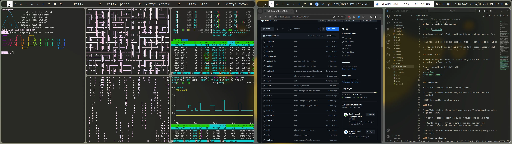

# dwm - dynamic window manager



dwm is an extremely fast, small, and dynamic window manager for X11.

This repo is a fork of dwm made for myself, feel free to use it :P

If you find any bugs, or want anything to be added please submit an issue.

## Installation

Compile configuration is in `config.mk`, the default install directory is `/usr/local/`

You can compile and install with
```sh
make clean
sudo make install
```

## Cheatsheet

My config is weird so here's a cheatsheet.

A list of all keybinds (which you can edit) can be found in `config.h`

`MOD` is usually the windows key

### Tags

Tags (labeled 1 to 9) can be turned on or off, windows in enabled tags are shown.

You can use tags as desktops by only having one on at a time

* `MOD+[1 to 9]`: Turn on a single tag and the rest off
* `MOD+shift+[1 to 9]`: Move focused window to a tag

You can also click on them on the bar to turn a single tag on and the rest off

### Managing windows

To spawn windows `dmenu` can be used for which I have [my own fork of aswell](https://github.com/sollybunny/dmenu) which can be opened with `MOD+r`

The terminal (default `kitty`) can be opened with `MOD+t` or by clicking on the status in the bar

You can focus a window by clicking on it or it's corrosponding space in the bar

You can close a window with `MOD+f4` (`alt-f4` does nothing, unless the window handles it), summon `xkill` with `MOD+shift+f4`, or `shift+rclick` on it's corrosponding space in the bar

You can cycle focus with `MOD+tab` (`alt-tab` does nothing)

### Moving Windows

Windows will spawn in a tiling mode, the mode can be changed by clicking the grid icon next to the tags, the default available modes area
* grid: It's a grid
* rows: One focused window, the rest are put into rows
* cols: One focused window, the rest are put into columns
* monocole: One focused window, the rest are put behind it
* floating: No tiling behaviour

You can drag windows with `MOD+lclick`, and resize with `MOD+[shift]+rclick` where holding shift ignores size hints

Clicking with `MOD+lclick` will set the mode to tiling, and if it's already tiling will make it the master. You can also click with `MOD+shift+mclick` to toggle floating / tiling

Windows style psuedo tiling is available, and might be more useful to some:
* `MOD+[qweasdzxc]`: Move focused window to location (try them)
* `MOD+shift+[qweadzxc]`: Force move focused window to location (ignores sizing hints)
* `MOD+shift+s`: Make focused window fullscreen
* `MOD+ctrl+s`: Make focused window centered and try to resize it
* `MOD+shift+ctrl+s`: Make focused window centered

## Requirements
* XLib
* XFT
* Pango
* Imlib2
* Iosevka Nerd Font (default in `config.h`)
* A Nerd Font (to show layouts)

## Configuration

Configuration can be found in `config.h`, a default config can be found in `config.def.h`

It is recommended to change some of these settings before using, these are listed in order of appearence in `config.h`
* `focusonhover`: Some may prefer focusing a window when you hover
* `resizemousewarp`: Some may prefer having the mouse warp (move) to the corner when resizing
* `col_fg`: Change to your favourite color, lilac (#ffddff) is the default
* `FONT_FAMILY`: Change to a font that you have installed, a font with nerd font support is preferred
* `TERM`: Change to the name of your terminal emulator, `kitty` is the default
* `screencmd`: Change the string `screenshot` to your screenshot tool, change `screenallcmd` to the command needed to take a fullscreen screenshot

## Running

Add the following line to your .xinitrc to start dwm using startx:
```sh
exec dwm
```

The root / status text can be updated using `xsetroot`
```sh
while true; do
	xsetroot -name "$(date)"
done
```

Many tools exist to do this such as:
* [`status`](https://github.com/SollyBunny/status): My own tool to do this
* [`slstatus`](https://tools.suckless.org/slstatus/): Suckless batteries uncluded status
* [`dwmstatus`](https://git.suckless.org/dwmstatus/): Suckless barebones status

## Patches

The code has been completley mangled and taking a diff with the original will not give you anything useful, as such trying to apply more patches automatically will fail. Here are the patches which were applied, they all have merge conflicts and have to be edited / rewritten to work at all.

* [https://dwm.suckless.org/patches/barpadding/dwm-barpadding-20211020-a786211.diff](https://dwm.suckless.org/patches/barpadding/dwm-barpadding-20211020-a786211.diff)
* [https://dwm.suckless.org/patches/cool_autostart/dwm-cool-autostart-20240312-9f88553.diff](https://dwm.suckless.org/patches/cool_autostart/dwm-cool-autostart-20240312-9f88553.diff)
* [https://dwm.suckless.org/patches/fixmultimon/dwm-fixmultimon-6.4.diff](https://dwm.suckless.org/patches/fixmultimon/dwm-fixmultimon-6.4.diff)
* [https://dwm.suckless.org/patches/pango/dwm-pango-20230520-e81f17d.diff](https://dwm.suckless.org/patches/pango/dwm-pango-20230520-e81f17d.diff)
* [https://dwm.suckless.org/patches/steam/dwm-steam-6.2.diff](https://dwm.suckless.org/patches/steam/dwm-steam-6.2.diff)
* [https://dwm.suckless.org/patches/clientindicators/dwm-clientindicators-6.2.diff](https://dwm.suckless.org/patches/clientindicators/dwm-clientindicators-6.2.diff)
* [https://dwm.suckless.org/patches/fancybar/dwm-fancybar-20220527-d3f93c7.diff](https://dwm.suckless.org/patches/fancybar/dwm-fancybar-20220527-d3f93c7.diff)
* [https://dwm.suckless.org/patches/moveresize/dwm-moveresize-20221210-7ac106c.diff](https://dwm.suckless.org/patches/moveresize/dwm-moveresize-20221210-7ac106c.diff)
* [https://dwm.suckless.org/patches/fullgaps/dwm-fullgaps-6.4.diff](https://dwm.suckless.org/patches/fullgaps/dwm-fullgaps-6.4.diff)
* [https://dwm.suckless.org/patches/alpha/dwm-alpha-20230401-348f655.diff](https://dwm.suckless.org/patches/alpha/dwm-alpha-20230401-348f655.diff)
* [https://dwm.suckless.org/patches/alwaysontop/alwaysontop-6.2.diff](https://dwm.suckless.org/patches/alwaysontop/alwaysontop-6.2.diff)
* [https://dwm.suckless.org/patches/winicon/dwm-winicon-6.3-v2.1.diff](https://dwm.suckless.org/patches/winicon/dwm-winicon-6.3-v2.1.diff)
* [https://dwm.suckless.org/patches/columngaps/dwm-columngaps-20210124-f0792e4.diff](https://dwm.suckless.org/patches/columngaps/dwm-columngaps-20210124-f0792e4.diff)

